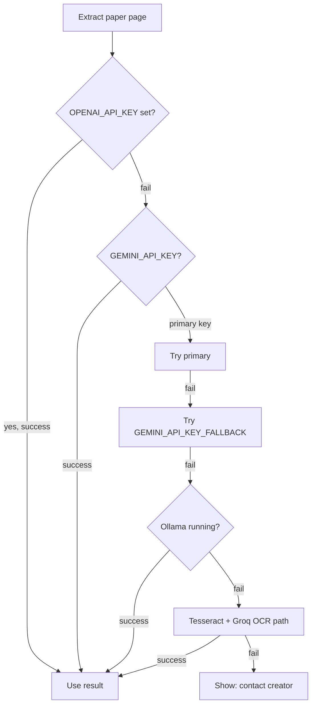

# Old Paper Service — Reference Guide

Official CET papers from RSMSSB (Rajasthan RSSB), synced by admin, taken by all students via the **Old Papers** tab.

> Product context: [PRODUCT.md](./PRODUCT.md) · Docs index: [README.md](./README.md) · Extraction CLI: [PAPER_EXTRACTION.md](./PAPER_EXTRACTION.md)

---

## Quick start (local admin on your PC)

### 1. Environment variables (`backend/.env`)

Add these (never commit real keys to git):

```env
GEMINI_API_KEY=
GEMINI_API_KEY_FALLBACK=

# Fallback Gemini key — used if primary fails (rate limit / error)
GEMINI_API_KEY_FALLBACK=

# Optional — add later for best vision quality
OPENAI_API_KEY=

# Already required for your OCR scripts
GROQ_API_KEY=
POPPLER_BIN_PATH=C:\path\to\poppler\Library\bin

# Optional local vision (Ollama)
OLLAMA_BASE_URL=http://localhost:11434
OLLAMA_VISION_MODEL=gemma4:e4b

# Provider order: try 1 → 2 → 3 → 4, then fail with admin message
AI_VISION_PROVIDER_ORDER=openai,gemini,ollama,ocr

OFFICIAL_PAPER_MIN_MATCH_RATIO=0.8
OFFICIAL_PAPER_DURATION_MINUTES=120
ADMIN_CONTACT_MESSAGE=All AI providers failed. Contact the ExamSaathi creator to fix API keys or Poppler setup.
```

**Get Gemini keys:** [https://aistudio.google.com/apikey](https://aistudio.google.com/apikey) (free tier, no card required initially).

### 2. Admin user (MongoDB)

```js
db.users.updateOne(
  { email: "your@email.com" },
  { $set: { role: "admin" } }
)
```

### 3. Run backend + frontend

```bash
cd backend && npm run dev
cd frontend && npm run dev
```

Open **Old Papers** tab → **Sync from RSMSSB** (admin only).

---

## AI provider fallback chain

When extracting questions from PDF pages, the system tries each provider in order. If one fails, it moves to the next. If **all** fail, sync stops and shows a message to contact you (the creator).



| Order | Provider | Env | Cost |
|-------|----------|-----|------|
| 1 | OpenAI | `OPENAI_API_KEY` | Paid (best quality) |
| 2 | Gemini Flash | `GEMINI_API_KEY` → `GEMINI_API_KEY_FALLBACK` | Free tier / very cheap |
| 3 | Ollama | `OLLAMA_BASE_URL` + model | Free (local PC) |
| 4 | OCR + Groq | `GROQ_API_KEY` + Poppler | Free tier |

**Groq** is also used for topic classification and JSON structuring after text is extracted (not for reading images directly).

---

## Feature overview

| Tab | Type | Who creates | Shared? |
|-----|------|-------------|---------|
| Real Paper | `real-paper` | Each student (AI mock) | Per user |
| Old Papers | `official-paper` | Admin sync | All students |

### Student flow

1. Open **Old Papers** for CET 12th or CET Graduation
2. Pick a year/set → **Start Test**
3. Same `QuizPlayer` as mocks: timer (120 min for official papers), negative marking (+2 / −⅔)

### Admin flow

1. Open **Old Papers** → **Sync from RSMSSB**
2. Backend scrapes CET question papers + answer keys from Rajasthan site
3. Downloads PDFs, extracts MCQs, matches answer key
4. Publishes quiz if ≥ 80% questions matched (configurable)
5. Progress shown in UI (poll job status)

---

## RSMSSB sources

- Question papers archive: `https://rsmssb.rajasthan.gov.in/show_archived?menuName=Xj4lCb9vGxpQnfLs/xlZ2g==`
- Answer keys: separate archived page (scraped automatically)
- Download URL pattern: `https://rsmssb.rajasthan.gov.in/download_file?downloadFileId=XXXX`

Filtered titles:

- **cet-12th:** `CET (Sr. Sec.)`, `Common Eligibility Test (Sr. Sec. Level)`
- **cet-graduation:** `CET (Graduation Level)`

QP ↔ answer key paired by year + set code (e.g. `V23`, `131A`).

---

## API endpoints

| Method | Path | Auth | Purpose |
|--------|------|------|---------|
| GET | `/api/official-papers/exams/:examId` | User | List published official papers |
| POST | `/api/admin/official-papers/exams/:examId/sync` | Admin | Start sync job |
| GET | `/api/admin/official-papers/sync/:jobId` | Admin | Poll sync progress |
| GET | `/api/quiz/quizzes/:quizId` | User | Load quiz (real-paper + official-paper) |
| POST | `/api/quiz/quizzes/:quizId/attempt` | User | Submit attempt |

---

## Database models

### `officialPaperCatalog`

Tracks each RSMSSB paper: URLs, status, extraction stats, linked `quizId`.

Statuses: `pending` → `downloading` → `extracting` → `published` | `failed`

### `quiz` (extended)

- New type: `official-paper`
- Fields: `year`, `setCode`, `durationMinutes` (default 120), `sourceUrls`

### `question`

- `source: "previous-paper"`, `pattern: "old"`, `year`

---

## Prerequisites

| Item | Required? | Notes |
|------|-----------|-------|
| Poppler (`pdftoppm`) | Yes for image PDFs | `POPPLER_BIN_PATH` |
| MongoDB Atlas | Yes | Existing |
| GROQ_API_KEY | Yes (for OCR fallback + structuring) | Existing |
| GEMINI_API_KEY | Recommended | Primary extraction |
| GEMINI_API_KEY_FALLBACK | Recommended | Second Gemini key |
| OPENAI_API_KEY | Optional | Best quality when added |
| Ollama + gemma4 | Optional | Free local fallback |

---

## Troubleshooting

| Problem | Fix |
|---------|-----|
| `429` from Gemini | Wait or use `GEMINI_API_KEY_FALLBACK`; spread sync over time |
| Poppler not found | Set `POPPLER_BIN_PATH` to folder with `pdftoppm.exe` |
| Low match rate / `failed` status | Paper too scanned; try OpenAI key or manual CLI script |
| Sync button missing | Set `role: "admin"` on your user |
| All providers failed | Check env keys, Poppler, Ollama running; message tells user to contact creator |

### Manual CLI fallback (existing)

```bash
node src/scripts/fetchPreviousPaperOCR.script.js cet-12th "<question-pdf-url>" "<answer-pdf-url>" 2024
```

---

## Cost estimate (admin sync only)

| Provider | Per CET paper (~40 pages) |
|----------|---------------------------|
| Gemini Flash (free tier) | ₹0 if within quota |
| Gemini paid | ~₹1–5 |
| OpenAI gpt-4o-mini | ~₹10–20 |
| Ollama / OCR+Groq | ₹0 |

Students do **not** trigger AI calls during quiz — only admin sync does.

---

## Security

- Never commit `backend/.env`
- Rotate API keys if exposed in chat or logs
- Free Gemini tier may use prompts for Google model improvement; use paid tier for strict privacy

---

## Implementation file map

```
backend/src/
  models/officialPaperCatalog.model.js
  models/syncJob.model.js
  services/ai/aiProvider.service.js
  services/ai/geminiVision.provider.js
  services/ai/openaiVision.provider.js
  services/ai/ollamaVision.provider.js
  services/ai/ocrGroq.provider.js
  services/pdfUtils.service.js
  services/rsmssbScraper.service.js
  services/paperExtraction.service.js
  services/officialPaperIngestion.service.js
  services/officialPaper.service.js
  middleware/admin.middleware.js
  routes/officialPaper.routes.js
  controllers/officialPaper.controller.js

frontend/src/
  views/exams/OldPapersPage.tsx
  app/(dashboard)/exams/[examId]/old-papers/page.tsx
  services/officialPapers/officialPaperService.ts
```

---

*Last updated: aligned with current ExamSaathi product (daily streak, shared topic bank, AI Tutor, mocks). See [PRODUCT.md](./PRODUCT.md).*
